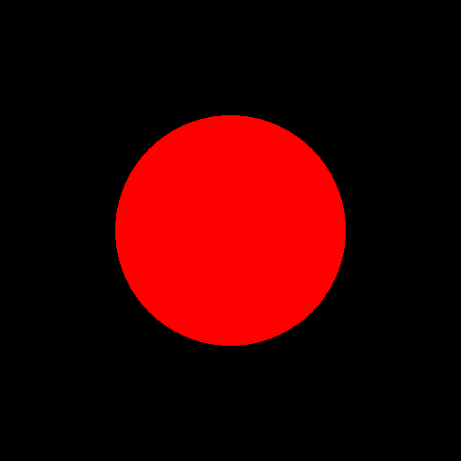
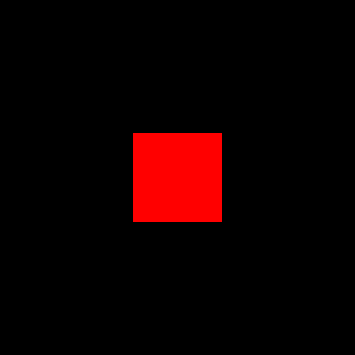
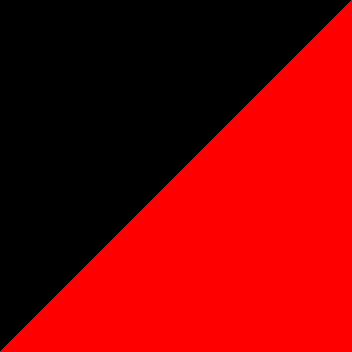

# CMPN205 Project - Phase 1 Instructions

The goals of phase 1 of the graphics project is:

- Learn how to open a window and load OpenGL.
- Learn how a graphics project can be organized as a set of states.
- Learn how to write GLSL shaders.
- Learn how to load and use a GLSL shader in a graphics application.

---

## Code Structure

The code is divided into 2 folders:

- **source**: where we store all of our code including our `main.cpp`. Here, we further divide our code into 2 subfolders:
  - **common**: where we put all the code that will be used by different states.
  - **states**: which contains the different state classes.
- **vendor**: which contains the libraries we need for the project.

The `main.cpp` contains the main function which do the following:

1. Parse the command line arguments.
2. Reads the application configuration.
3. Creates an Application object.
4. Registers all the states and select the initial state.
5. Call the application `run` function.

Inside `application::run()`, the following steps are executed:

1. Setup GLFW error callback and initialize GLFW.
2. Configure OpenGL options.
3. Create a window and make it the current context.
4. Load OpenGL functions and setup OpenGL error callbacks.
5. Initialize Keyboard and Mouse objects to capture user input.
6. Initialize IMGUI which can be used to create GUI (e.g. text boxes and buttons).
7. Read all the screenshot requests from the configuration (used for testing and grading).
8. Initialize the current state.
9. Loop while the window is not closed:
   1. Poll events (e.g. key presses, mouse moves).
   2. Update the IMGUI (let the GUI respond to user input).
   3. Draw the current state.
   4. Draw the IMGUI.
   5. Save screenshots if requested by user or configuration.
   6. Swap buffers.
   7. Update the keyboard and mouse objects.
   8. Change the state if requested.
10. Destory the state and other resources then exit.

In every `state`, there are three important overrideable functions:

- `onInitialize()` is called once when enter the state.
- `onDraw(double deltaTime)` is called every frame where we should update and draw our scene. `deltaTime` contains the time difference between the current and the last frame.
- `onDestroy()` is called once when exit the state.

Other than these three functions, states have the following less important yet useful overrideable functions:

- `onImmediateGui()` where we draw our GUI if needed.
- `onKeyEvent(int key, int scancode, int action, int mods)` which runs whenever any event related to the keyboard occurs.
- `onCursorMoveEvent(double x, double y)` which runs whenever the mouse moves inside the window.
- `onCursorEnterEvent(int entered)` which runs whenever the mouse enters or leaves the window.
- `onMouseButtonEvent(int button, int action, int mods)` which runs whenever any event related to the mouse buttons occurs.
- `onScrollEvent(double x_offset, double y_offset)` which runs whenever the mouse wheel is scrolled.

---

## Assets and Configurations

Other than code files, we have shader files which as stored in the `"assets/shaders"` folder. We also have json configuration files inside the `"config"` folder.

---

## How to run

To compile the code, you need `CMake` and a `C++17` compiler. Thus, you **CANNOT** use an version of Visual Studio older than `Visual Studio 2017`. As alternatives, you can use `GCC 9` (or newer) or `CLang 5` (or newer).

If you are using `Visual Studio Code` with the `CMake Tools` extension, you should find the `GAME_APPLICATION.exe` inside the folder `bin`. You should run the executable using a terminal from the project folder where the execution command will be:

    ./bin/GAME_APPLICATION.exe

This will run the application using the default configuration file `config/app.json`. To run another configuration (e.g. `config\circle01.json`), you should execute the command:

    ./bin/GAME_APPLICATION.exe -c='config/circle01.json'

If you want the want the application to automatically close after a certain number of frames (e.g. 10 frames), you should run:

    ./bin/GAME_APPLICATION.exe -c='config/circle01.json' -f=10

If you are working on Linux, remove the `".exe"` from the path for the executable.

To run all the configuration in sequence, you can run `run-all.ps1` on Powershell (for Windows) or `run-all.sh` on Bash (for Linux).

The screenshots should automatically be generated and added to the `screenshots` folder. Compare the results with the expected output from the folder `expected`. Later this week, we will send you an automatic comparison application that will facilitate comparing the results in batch.

---

## Requirements

For this phase, you are required to fill in missing parts of the code till each part works as expected and the screenshots match the expected output. Each part you have to fill is marked by a `//TODO` comment. In addition, you are required to write **COMMENTS** that explain the code you write. For functions from OpenGL, it is encouraged to briefly explain the arguments of the functions you use in order to show that you understand how the function is used and its purpose.

The requirements are divided into 3 parts which we will discuss in the following sections.

### Clear Color State

In the file `"source\states\clear_color_state.hpp"`, you will need to modify the `onInitialize()` function to read the clear color from the json configuration and set it to be clear color used for clearing the window.

### Shader Class and Fullscreen Triangle State

This part has 3 related files:

- The first two files are the `"source/common/shader/shader.hpp"` and `"source/common/shader/shader.cpp"`. You will find multiple functions that you will need to complete. These functions are used in `"source\states\fullscreen_triangle_state.hpp"` so you can look there to see how they will be used.
- The third file is `"source\states\fullscreen_triangle_state.hpp"` which selects the shaders to load based on the configuration file and also sets the uniforms based from the configuration. However, the file is missing the code to draw the fullscreen triangle to the screen which you should add in.

After the the 3 files are done, you should see the split into 2 parts where the color on the left is different from the color on the right (the colors depend on the configuration file).

### Fragment Shaders

Currently, the 4 fragment shaders draw the same thing. We will need each of them to draw a different shape. All the shaders receive two color uniforms: `inside_color` and `outside_color` which define the color inside and outside the shape respectively. The shapes are:

- **Circle**: where a point is considered inside the shape if the euclidean distance between the current fragment and the circle's center is less than or equal the radius. The euclidean distance is measured as: $\sqrt{(x-x_c)^2 + (y-y_c)^2}$. The shader should receive 2 more uniforms:
  - _radius_: which defines the radius of the circle in pixels.
  - _center_: which defines the center of the circle in pixels.

<code>center = (256, 256), radius = 128</code>

- **Square**: where a point is considered inside the shape if the infinity norm distance between the current fragment and the squares's center is less than or equal half the side length (width and height). The infinity norm distance is measured as: $\max(|x-x_c|, |y-y_c|)$. The shader should receive 2 more uniforms:
  - _side-length_: which defines the width and height of the square in pixels.
  - _center_: which defines the center of the square in pixels.

<code>center = (256, 256), side_length = 128</code>

- **Diamond**: where a point is considered inside the shape if the manhattan distance between the current fragment and the diamond's center is less than or equal half the side length (width and height). The manhattan distance is measured as: $|x-x_c| + |y-y_c|$. The shader should receive 2 more uniforms:
  - _side-length_: which defines the width and height of the diamond in pixels.
  - _center_: which defines the center of the diamond in pixels.

<code>center = (256, 256), side_length = 128</code>

- **line**: where a point is considered inside the shape it satisfies the condition $y \leq ax + b$ where a is the "slope" and b is the "intercept". The shader should receive 2 more uniforms:
  - _slope_: which defines the slope of the separating line.
  - _intercept_: which defines the intercept of the separating line in pixels.

<code>slope = 1, intercept = 0</code>

Once done, the screenshots should match the expected output. Each student should be responsible for one of the aforementioned shader. In case there are 3 members in the team, only 3 shaders are needed for Phase 1 delivery.

---

## Team Formation

Each team **MUST** be 4 students. Thus only one or two teams of 3 students will be allowed if it is impossible to find a way to reorganize them as teams of 4 students. All the team members must be from the same tutorial since the phase discussions will be on-campus during the tutorial time slot. Write your team members in the attached sheet before **Saturday October 30th 2021 23:59**.

Each member should have full understanding of the project, including parts they did not write (except the shape shaders written by other team members). The grade for each student will be a combination of the whole team grade and an individual contribution and understanding grade.

---

# Delivery and Dicussion

Phase 1 delivery and discussion will be during Week 5 tutorials on Sunday 7th and Monday 8th of November 2021. A discussion schedule will be published before Sunday November 7th 2021. A blackboard assignment will be open for Phase 1 delivery where all the modified files containing the solutions by each team must be delivered by one member from that team before Monday November 8th 2021 23:59.

Each member should have full understanding of the project, including parts they did not write (except the shape shaders written by other team members). The grade for each student will be a combination of the whole team grade and an individual contribution and understanding grade.

The delivered files will be automatically scanned for plagiarism detection. Any evidence of plagarism will lead to losing the whole grade of the corresponding phase for both teams.

---

## Useful Resources

- Tutorials
  - [Learn OpenGL](https://learnopengl.com/)
  - [Open.GL](https://open.gl/introduction)
  - [OpenGL-Tutorial](http://www.opengl-tutorial.org/)
  - [The Book of Shaders](https://thebookofshaders.com/)
- References
  - [OpenGL Wiki](https://www.khronos.org/opengl/wiki/)
  - [OpenGL Reference](https://www.khronos.org/registry/OpenGL-Refpages/gl4/)
  - [docs.GL](https://docs.gl/)